# **Backgkournd:**
This model conducts dynamic real-time cost-based routing by computing incurred risk cost. Quantification of incurred collision risk is conducted through a hierarchical modeling approach that features two successive CatBoost models. This pipeline produces a collision risk value that can be used to select optimal routes.

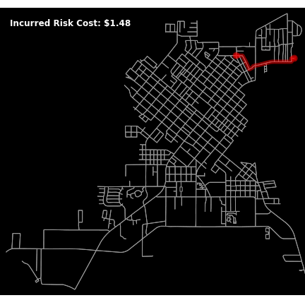

     

# **Model Outline:**
This project is sub-divided into three major sections:

    1. Data Collection 
    2. Model Training 
    3. Model Application

### **Stage 1: Data Collection**
_____

### **Stage 2: Model Training**
_____
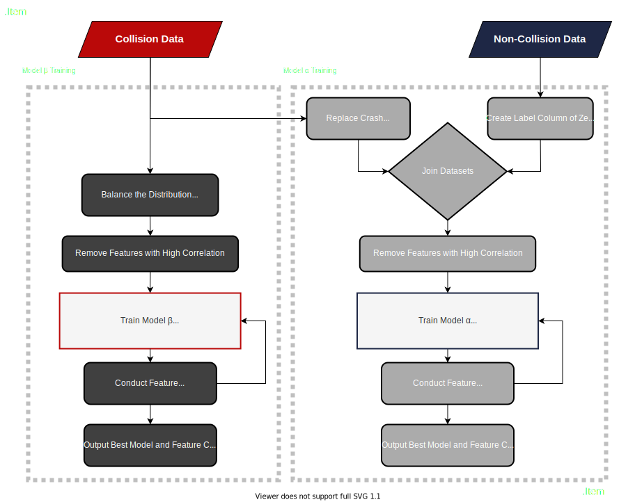

### **Stage 3: Model Application**
____
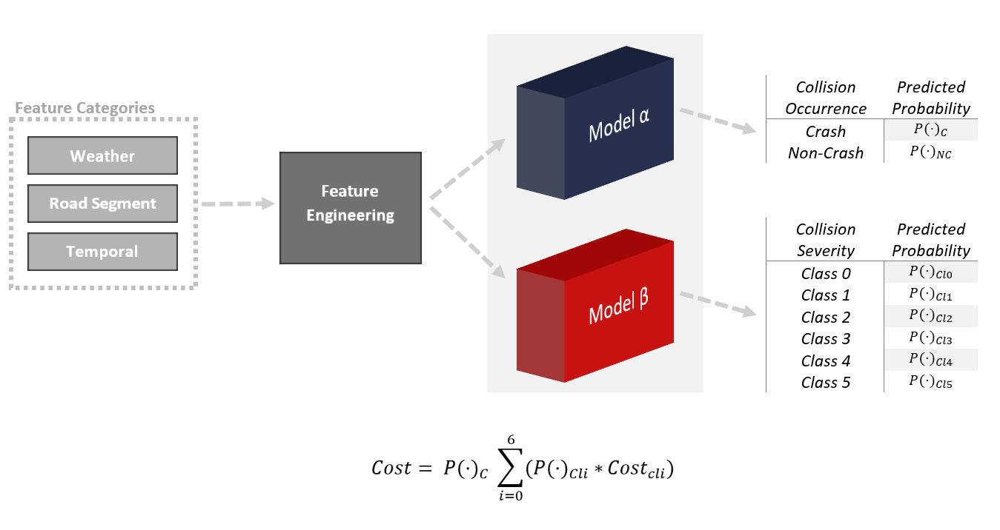

    

# **Step up:**

All required packages can be installed with the following command.

    pip install -r requirements.txt

This model can be ran out of the following notebook:

    Dynamic_Risk_Modeling.ipynb

    

# **Detailed Explanation:**

 

## **Stage 1: Collision Data Collection**

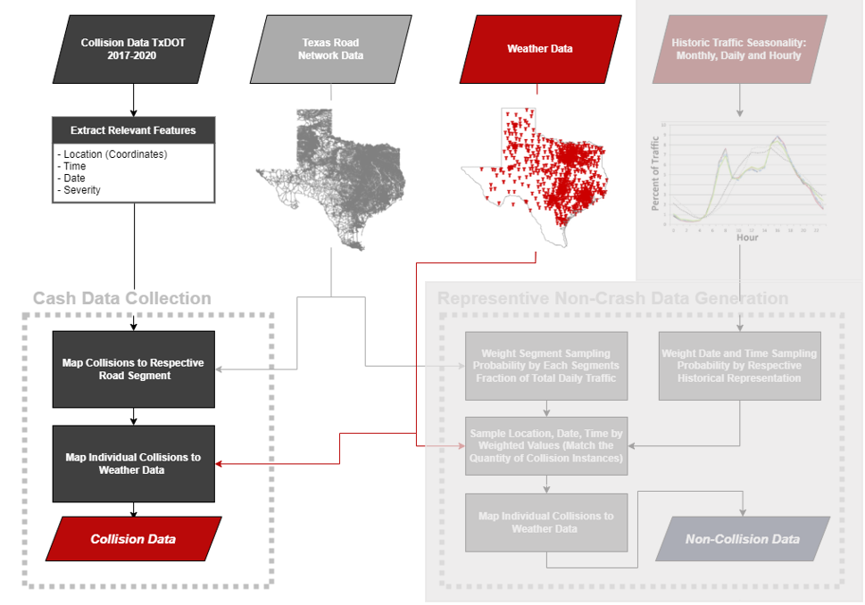

 

### *Stage 1.1.1: Collision Data Network Mapping*

Every collision was mapped to the road segment of occurrence. Road network data was obtained from [TIGER/Line Shapefiles]('https://www.census.gov/geographies/mapping-files/time-series/geo/tiger-line-file.html'). This project concentrates on the state of Texas and a visualization  of the segment network used for this project is listed below:

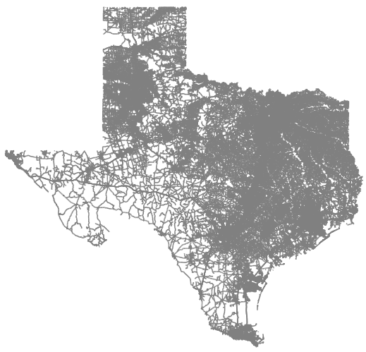

Collision data was extracted from the [Texas Department of Transportation (TxDOT)]('https://www.txdot.gov/government/enforcement/crash-statistics.html'). This dataset maintained over 1.4 million collision instances spaning from the beginning of 2017 until the end of 2020

### *Stage 1.1.2: Weather Data*

This project developed methodology to extract both historical and real-time weather data. Using this method the previously mentioned collision segment pairs were then matched with local weather data within five-minutes of event occurrence. The weather station network implemented for this project reports in five-minute intervals and maintains a high level of density within the observation area. Listed below is a sample of the local granularity of weather stations.

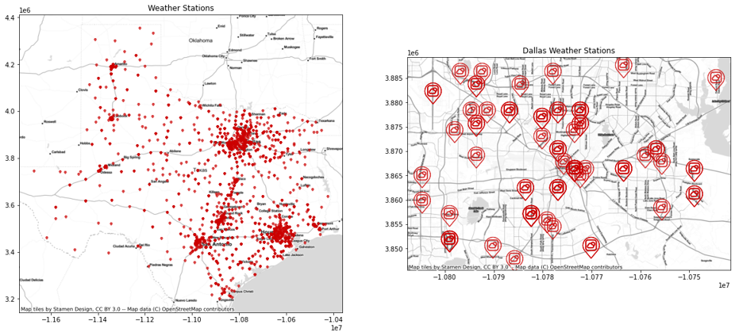

### Stage 1.2: Non-Collision Data Generation

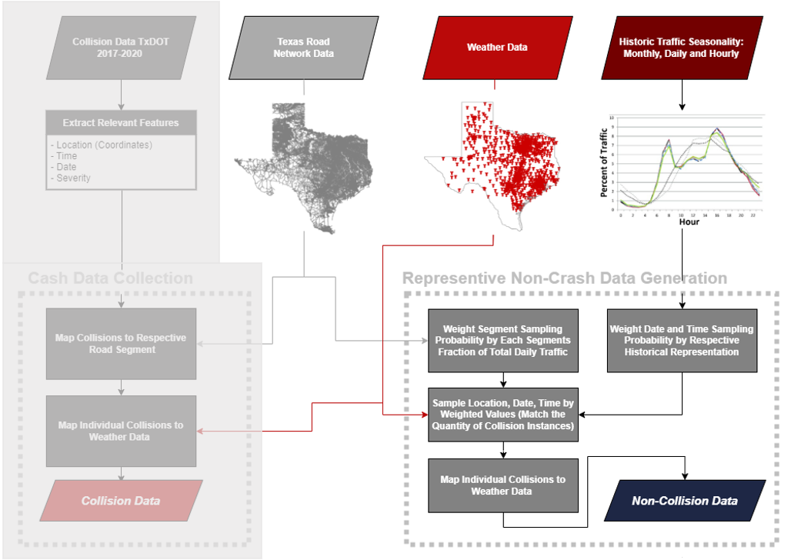

### *Stage 1.2.1: Non-Collision Data Network Mapping*

Representation of road segments within the non-crash data set were sampled to match the distribution of total trips throughout the state of Texas. This method ensures that segments are sample with respect to traffic volume. To obtain this representative sample, data was sampled with the weighted probability of selection being assigned by each segments fraction of total average annule daily traffic (AADT). Below depicts the representation of major road classes after proportional sampling.

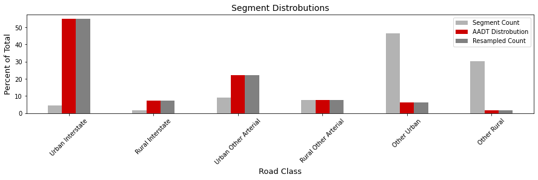

### *Stage 1.2.2: Non-Collision Date/Weather Mapping*

Dates and time were then paired with the selected segments via their seasonal, monthly, daily and hourly variation. As a result, dates and time with higher traffic volume will have a proportional increase in the probability of selection. The plot below details the percent historical distribution of traffic per-month.

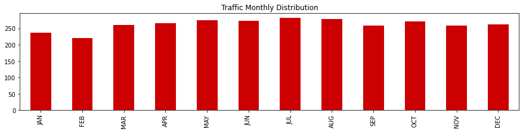

Below shows the daily and hourly distributions of traffic volume.

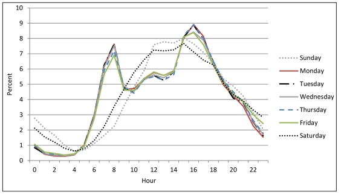

After pairing sampled segments with time and dates. Weather data for those respective time periods were also merge with the dataset. 

   

## **Stage 2.1: Model α Training**

 

### *Stage 2.1.2: Feature Selection*

Model features were pruned by permutated feature importance. The 102 intail features were reduced to the following set of principle features.

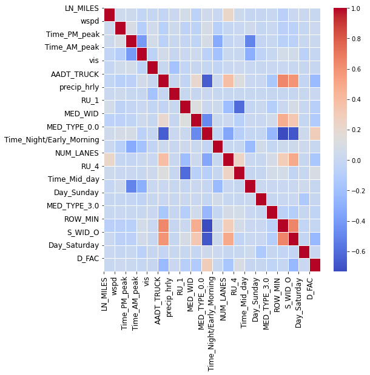

### *Stage 2.1.3: Model Preformance*

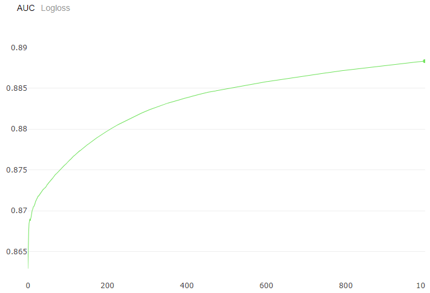

### *Stage 2.1.4: Model Inference*

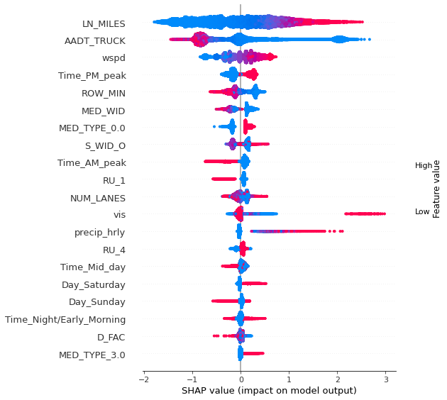

   

## **Stage 2.2: Model β Training**
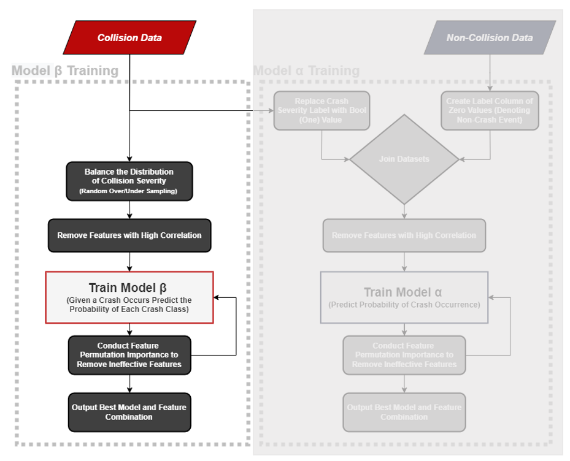

 

### Stage 2.2.1: Data Balancing

The β Model was trained to predict crash severity given that a collision does occur. To prevent model biasing the distributions of crash severity were balanced. 

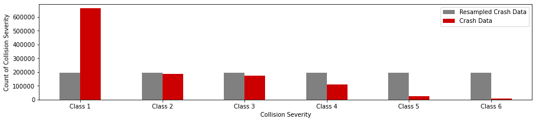

### *Stage 2.2.2: Feature Selection*

Model features were pruned with their permutated feature importance. The 102 features were reduced to the following set of principle features.

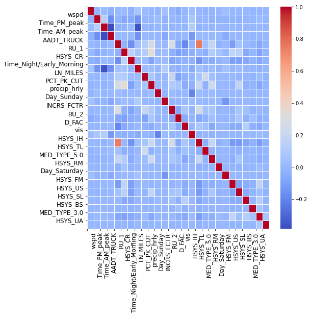

### *Stage 2.2.3: Model Preformance*

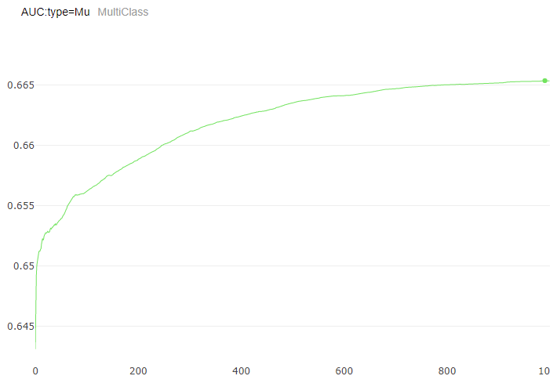

### *Stage 2.2.4: Model Inference*

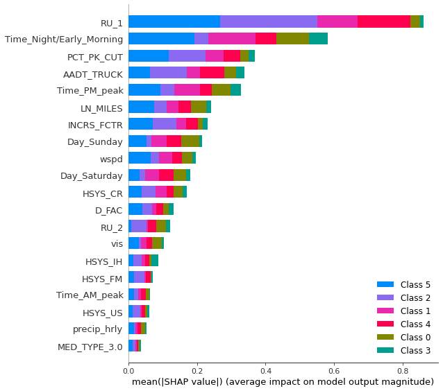

   

## **Stage 3: Model Application**

This model utilizes the Highway Safety Manual’s comprehensive crash cost inline with out model pipeline to convert route options to incurred risk cost.

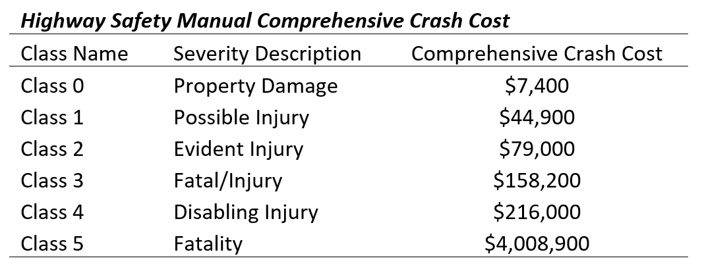

  

### *Stage 3.1: Model Demonstration Routing*

This model can be applied to any route within the state of Texas. For demonstration, the small city of Fredericksburg, Texas was selected for application. 

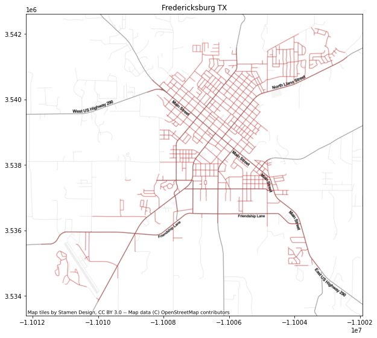

For demonstration, each trips incurred risk cost are calculated on randomly generated trips within the cite of Fredericksburg, Texas.

   

### *Stage 3.2: Model Demonstration Network Level*

The collision risk engendered from these models can also be viewed at network level.

Below details the variation in risk across various time period. The Entire State of Texas and Dallas, Texas are plotted below in respective order.

Holding all other features constant allow the model to isolate the effects of one feature. The plot below shows the variation is risk to the level of percipitation.

### Dallas, Texas

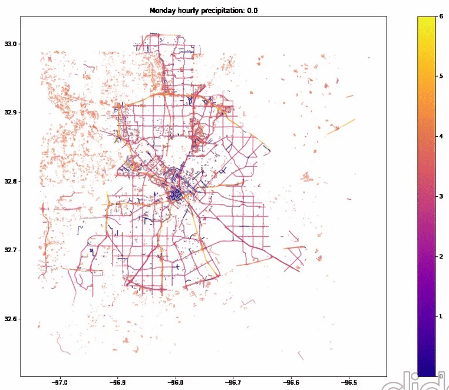

